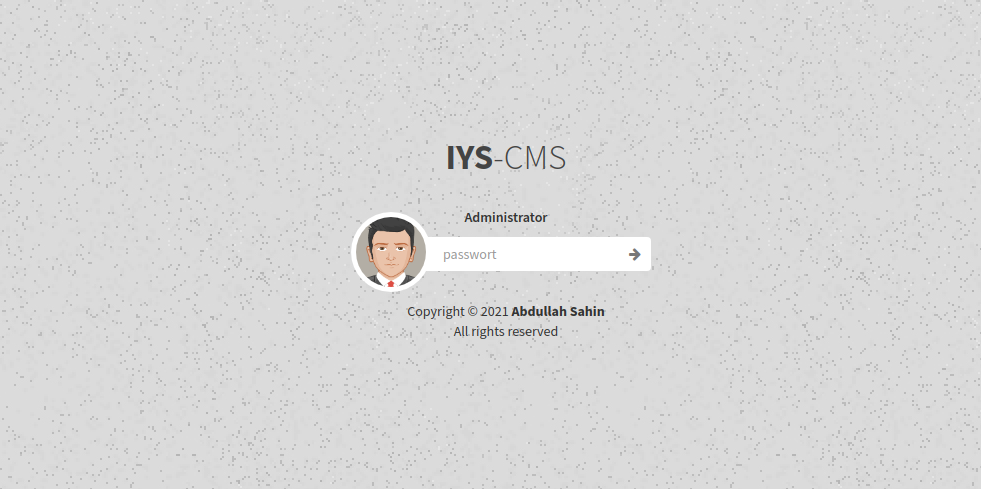
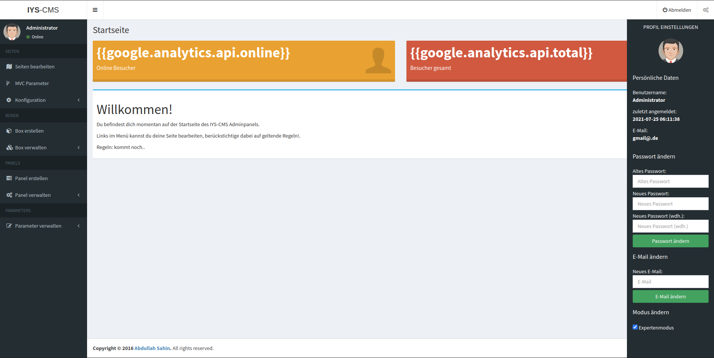
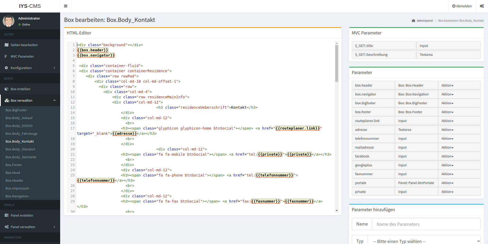
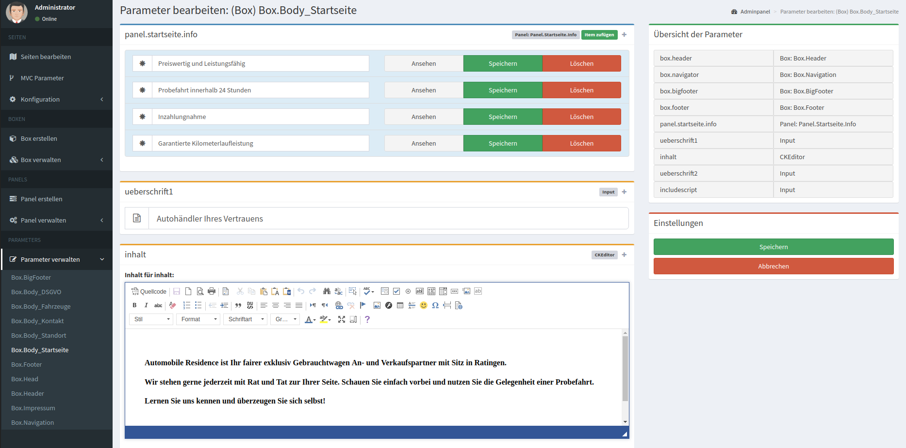
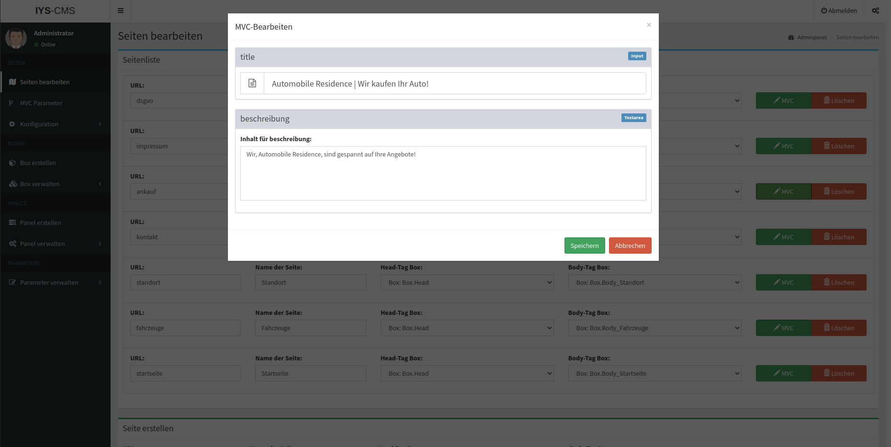
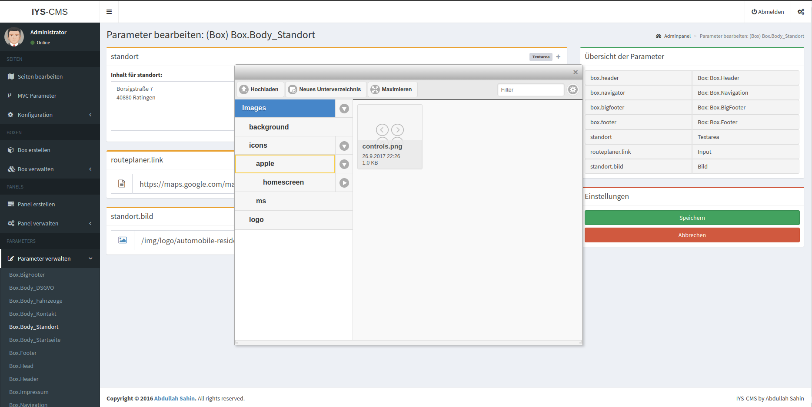

# iys-cms

a basic cms made by myself.

icerik yönetim sistemi - content management system

## test-user

`Administrator` : `password`

## config

`httpd.www/adm/php/Classes/Connection.class.php`:

```php

...

    private function Connect()
    {
        $this->settings["host"]     = 'localhost';
		$this->settings["dbname"]   = 'iys_cms';
		$this->settings["user"]     = 'root';
		$this->settings["password"] = 'password';
		
        $dsn            = 'mysql:dbname=' . $this->settings["dbname"] . ';host=' . $this->settings["host"] . '';
        try {
          
            $this->pdo = new PDO($dsn, $this->settings["user"], $this->settings["password"], array(
                PDO::MYSQL_ATTR_INIT_COMMAND => "SET NAMES 'utf8'",
				PDO::MYSQL_ATTR_INIT_COMMAND => "SET CHARACTER SET 'utf8'"
            ));
            $this->pdo->setAttribute(PDO::ATTR_ERRMODE, PDO::ERRMODE_EXCEPTION);
            $this->pdo->setAttribute(PDO::ATTR_EMULATE_PREPARES, false);
            $this->bConnected = true;
        }
        catch (PDOException $e) {
            echo $this->ExceptionLog($e->getMessage());
            die();
        }
    }

...

```

## todos

- [ ] admin backend supporting multi user with different permissions


## some nice screenshots















## live-demos

- https://automobile-residence.de
- https://backup-1.clan.rip/ (residence-service.de)
- https://backup-2.clan.rip/ (carmix-duisburg.de)
- https://backup-3.clan.rip/ (inseratfinder.de)

## installation:

1. find and replace color of style.css:

```
#007f6c = new hex color code
#3b8af2 = new hex color code for darker color
```

2. find and replace geo location coordinates of map.js:

```
var cLoc= new google.maps.LatLng(51.49673812527412, 7.207645637930531);
```

3. replace `sahin.cloud` with `yournewdomain.tld` at `./config/initdb/001_create.sql`.


3. install `./config/initdb/001_create.sql` to your database.

4. replace the logos/icons under `./web/img/icons`

5. update `sitemap.xml` at `admin`
6. update `urllist.txt` at `admin`
7. update all `Parameters` under `Parameter verwalten`
8. if you are not using automobile feature:
   1. remove via `Seite bearbeiten` `Ankauf` & `Fahrzeuge`
   2. remove `Ankauf` & `Fahrzeuge` from `Box.BigFooter > panel.sitemap`
   3. remove `Ankauf` & `Fahrzeuge` from `Box.Navigation > panel.menulinkPanel`
   4. remove this part of code from `Box verwalten > Box.Body_Startseite` 
   ```
   		  		<!-- START: remove me if not automobile page -->
				<div class="row">
					<div class="col-md-12">
							<hr class="iysCmsAutoHaendler">
							<h1 class="iysCmsAutoHaendlerText">{{ueberschrift2}}</h1>
							<hr class="iysCmsAutoHaendler">
						{{includescript}}
					  <br>
					  <br>
					  <br>
					  <br>
					</div>
				</div>
		  		<!-- END: remove me if not automobile page -->
    ```


## secrets.php:

```
<?php
define("MOBILE_DE_API_PUBLIC", "xxxxxxx");
define("MOBILE_DE_API_SECRET", "xxxxxxx");

define("DB_HOST", "database");
define("DB_PASSWORD", "password");
define("DB_USERNAME", "iys_cms");
define("DB_NAME", "iys_cms");

define("SMTP_USER", "xxxxxxx");
define("SMTP_PASSWORD", "xxxxxxx");
define("SMTP_HOST", "xxxxxxx");
define("SMTP_PORT", "xxxxxxx");
?>
```

## usefull commands:
```
find -type f -print0 | xargs -0 sha256sum | sort -k 2 > ./hashes.sha256       
gpg --symmetric --cipher-algo AES256 web/secrets.php
gpg --quiet --batch --yes --decrypt --passphrase="PASSWORD" --output web/secrets.php web/secrets.php.gpg;
```

## copyright

abdullah sahin @ sahin.uk


