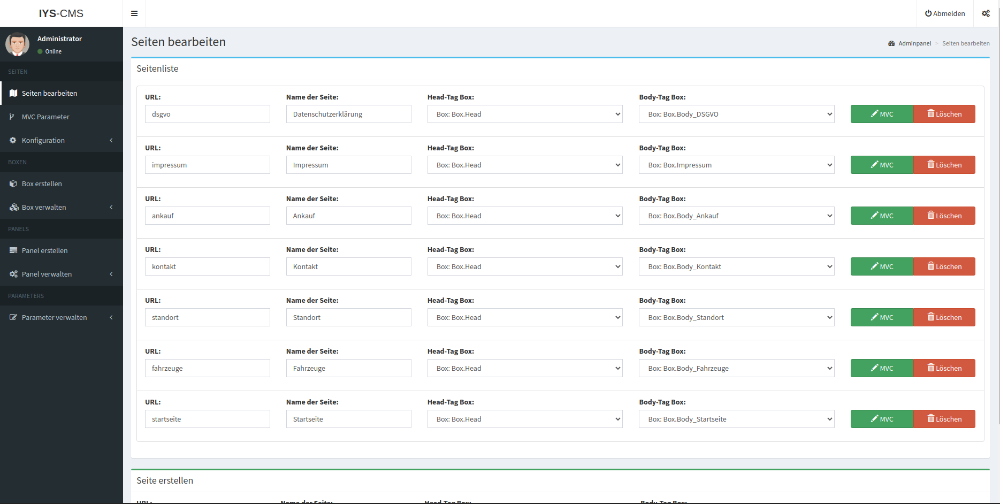

# iys-cms

a basic cms made by myself.

icerik yönetim sistemi - content management system

## test-user

`Administrator` : `password`

## config

`httpd.www/adm/php/Classes/Connection.class.php`:

```php

...

    private function Connect()
    {
        $this->settings["host"]     = 'localhost';
		$this->settings["dbname"]   = 'iys_cms';
		$this->settings["user"]     = 'root';
		$this->settings["password"] = 'password';
		
        $dsn            = 'mysql:dbname=' . $this->settings["dbname"] . ';host=' . $this->settings["host"] . '';
        try {
          
            $this->pdo = new PDO($dsn, $this->settings["user"], $this->settings["password"], array(
                PDO::MYSQL_ATTR_INIT_COMMAND => "SET NAMES 'utf8'",
				PDO::MYSQL_ATTR_INIT_COMMAND => "SET CHARACTER SET 'utf8'"
            ));
            $this->pdo->setAttribute(PDO::ATTR_ERRMODE, PDO::ERRMODE_EXCEPTION);
            $this->pdo->setAttribute(PDO::ATTR_EMULATE_PREPARES, false);
            $this->bConnected = true;
        }
        catch (PDOException $e) {
            echo $this->ExceptionLog($e->getMessage());
            die();
        }
    }

...

```

## todos

- [ ] admin backend supporting multi user with different permissions


## some nice screenshots





## live-demos

- https://automobile-residence.de
- https://backup-2.clan.rip/ (carmix-duisburg.de)

## copyright

abdullah sahin @ sahin.uk